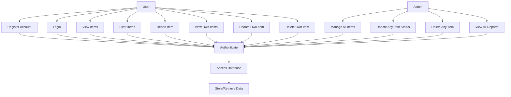
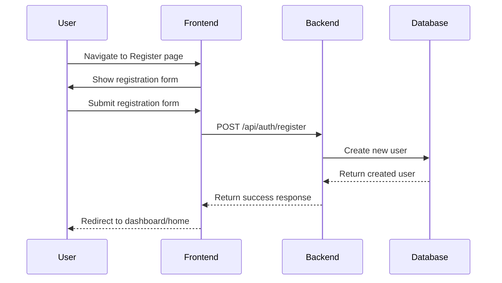
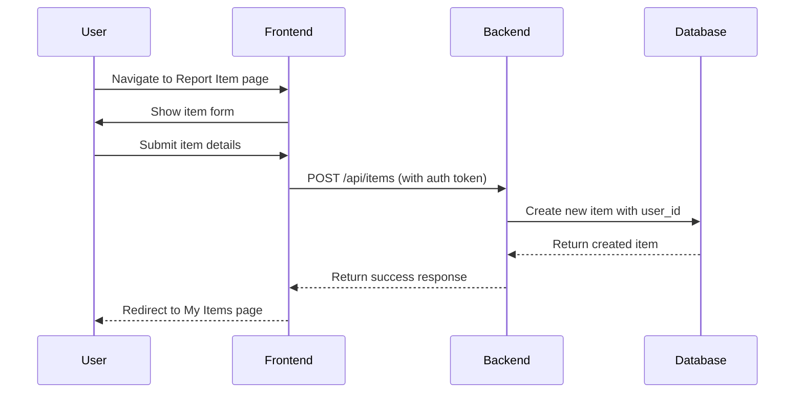
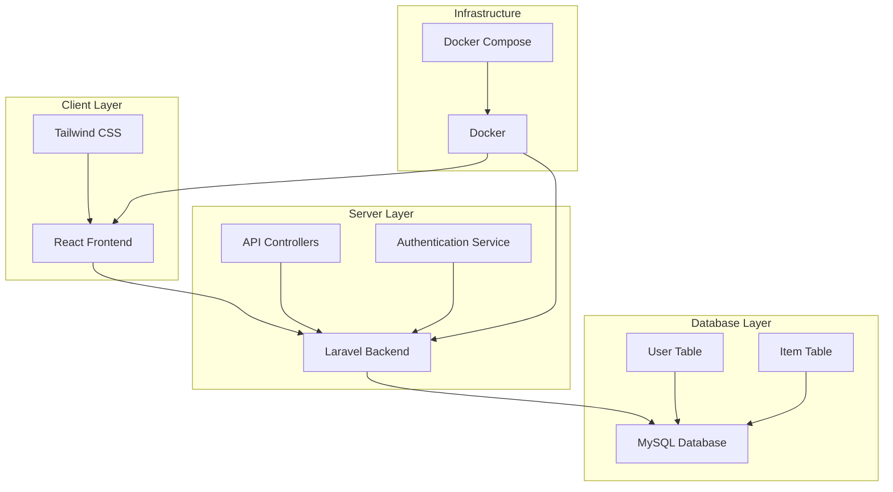

# UML Diagrams for Lost & Found Application

## Class Diagram

```mermaid
classDiagram
    class User {
        -int id
        -string name
        -string email
        -string password
        -string role
        -timestamp created_at
        -timestamp updated_at
        +bool isAdmin()
        +hasMany Item items()
    }

    class Item {
        -int id
        -int user_id
        -string title
        -text description
        -enum type (lost, found)
        -string location
        -enum status (pending, claimed, resolved)
        -string contact_info
        -timestamp created_at
        -timestamp updated_at
        +belongsTo User user()
    }

    class AuthController {
        +register(request)
        +login(request)
        +logout()
        +me()
    }

    class ItemController {
        +index(request)
        +store(request)
        +show(item)
        +update(request, item)
        +destroy(item)
        +myItems()
    }

    class AdminMiddleware {
        +handle(request, next)
    }

    User ||--o{ Item : "has many"
    AuthController ..> User : "uses"
    ItemController ..> Item : "uses"
    ItemController ..> User : "uses"
    AdminMiddleware ..> User : "checks"
```

## Use Case Diagram



## Sequence Diagram - User Registration Flow



## Sequence Diagram - Item Reporting Flow



## Component Diagram

