# Lost & Found Application - UML Diagrams

## Class Diagram

```mermaid
classDiagram
    class User {
        <<Model>>
        +int id
        +string name
        +string email
        +string password
        +string role
        +timestamps created_at
        +timestamps updated_at
        +hasMany items
        +hasMany verifiedItems
    }

    class Item {
        <<Model>>
        +int id
        +int user_id
        +string title
        +string description
        +string type
        +string location
        +string status
        +string contact_info
        +string image_url
        +string verification_status
        +int verified_by
        +timestamps created_at
        +timestamps updated_at
        +belongsTo user
        +hasOne verifier
    }

    class AuthController {
        <<Controller>>
        +register()
        +login()
        +logout()
        +getCurrentUser()
    }

    class ItemController {
        <<Controller>>
        +index()
        +show()
        +store()
        +update()
        +destroy()
        +getMyItems()
        +getItemsForVerification()
        +verifyItem()
        +extractPublicIdFromUrl()
    }

    class CloudinaryService {
        <<Service>>
        -string cloudName
        -string apiKey
        -string apiSecret
        +uploadImage()
        +deleteImage()
    }

    class AuthService {
        <<Service>>
        +register()
        +login()
        +logout()
        +getCurrentUser()
    }

    class ItemService {
        <<Service>>
        +getItems()
        +getItemById()
        +createItem()
        +updateItem()
        +deleteItem()
        +getMyItems()
        +getAllItems()
        +getItemsForVerification()
        +verifyItem()
    }

    class AuthContext {
        <<Context>>
        -User user
        -bool loading
        +login()
        +register()
        +logout()
        +isAuthenticated()
    }

    class ItemForm {
        <<Component>>
        -formData
        -image
        -previewUrl
        +handleChange()
        +handleImageChange()
        +handleSubmit()
    }

    class Navbar {
        <<Component>>
        +render()
    }

    %% Relationships
    User ||--o{ Item : "owns"
    User ||--o{ Item : "verifies"
    AuthController ..> AuthService : "uses"
    ItemController ..> ItemService : "uses"
    ItemController ..> CloudinaryService : "uses"
    ItemForm ..> ItemService : "uses"
    Navbar ..> AuthContext : "uses"
    AuthContext ..> AuthService : "uses"
```

## Use Case Diagram

```mermaid
graph TB
    subgraph "Actors"
        Guest("👤 Guest")
        RegisteredUser("👥 Registered User")
        Admin("🛡️ Admin")
    end

    subgraph "Use Cases"
        UC1("📋 Register Account")
        UC2("🔐 Login to System")
        UC3("🚪 Logout")
        UC4("🔍 Browse Items")
        UC5("➕ Report Lost/Found Item")
        UC6("✏️ Edit Own Items")
        UC7("🗑️ Delete Own Items")
        UC8("👀 View Item Details")
        UC9("📊 View My Items")
        UC10("🔍 Search & Filter Items")
        UC11("✅ Verify Items")
        UC12("📋 Manage Pending Verifications")
        UC13("✅ Update Item Status")
        UC14("📤 Upload Images")
        UC15("🖼️ View Images")
    end

    %% Guest flows
    Guest -- "can" --> UC2
    Guest -- "must" --> UC1
    
    %% Registered User flows
    RegisteredUser -- "can" --> UC3
    RegisteredUser -- "can" --> UC4
    RegisteredUser -- "can" --> UC5
    RegisteredUser -- "can" --> UC6
    RegisteredUser -- "can" --> UC7
    RegisteredUser -- "can" --> UC8
    RegisteredUser -- "can" --> UC9
    RegisteredUser -- "can" --> UC10
    RegisteredUser -- "can" --> UC14
    RegisteredUser -- "can" --> UC15
    
    %% Admin flows
    Admin -- "can" --> UC11
    Admin -- "can" --> UC12
    Admin -- "can" --> UC13
    Admin -- "inherits" --> UC4
    Admin -- "inherits" --> UC8
    Admin -- "inherits" --> UC10
    
    %% Common flows
    Guest -- "inherits" --> UC4
    Guest -- "inherits" --> UC8
    Guest -- "inherits" --> UC10
    Guest -- "inherits" --> UC15

    %% Styling
    classDef actorClass fill:#e1f5fe,stroke:#01579b,stroke-width:2px
    classDef usecaseClass fill:#f3e5f5,stroke:#4a148c,stroke-width:2px
    class Guest,RegisteredUser,Admin actorClass
    class UC1,UC2,UC3,UC4,UC5,UC6,UC7,UC8,UC9,UC10,UC11,UC12,UC13,UC14,UC15 usecaseClass
```



## Description

### Class Diagram
This diagram shows the main classes and their relationships in the Lost & Found application:
- **User Model**: Represents users with roles (regular user or admin)
- **Item Model**: Represents lost/found items with verification status
- **Controllers**: Handle API requests and business logic
- **Services**: Handle external integrations and business logic
- **Components**: React frontend components
- **Context**: Global state management

### Use Case Diagram
This diagram shows the interactions between actors and system functionalities:
- **Guest**: Can browse and view items, must register/login to access more features
- **Registered User**: Can report items, manage own items, upload images
- **Admin**: Has additional verification and management capabilities